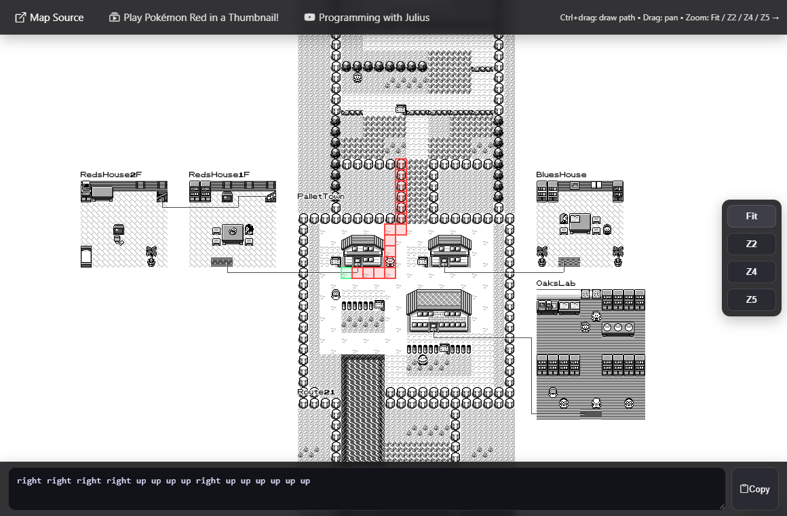

# Pokémon in a Thumbnail — Kanto Route Planner

An interactive Pokémon Red map for turning a drawn route into movement commands. Pan around Kanto, trace a path across the tile grid, and copy the resulting `up`, `down`, `left`, and `right` sequence.

**[Open the route planner](https://programming-with-julius.github.io/PokemonInThumbnailPage/)** · **[Watch: Play Pokémon Red inside of a YouTube thumbnail!](https://www.youtube.com/watch?v=bryeT4MtzDg)**



## What it does

- Explore a tiled map of Kanto, including towns, routes, and connected interior maps.
- Draw a path on the game's 16-pixel tile grid. The starting tile is green, and the subsequent tiles are red.
- Turn the path into a space-separated list of cardinal movement commands.
- Copy the commands with the clipboard button below the map.
- Pan and zoom with a mouse or touch screen, using **Fit**, **Z2**, **Z4**, and **Z5** for quick zoom changes.

## Using the planner

| Action | Mouse and keyboard | Touch screen |
| --- | --- | --- |
| Draw a path | Hold **Ctrl** and drag with the left mouse button | Drag with one finger |
| Move around the map | Drag without Ctrl | Pan with two fingers |
| Zoom | Mouse wheel or the zoom buttons | Pinch with two fingers or use the zoom buttons |
| Copy the route | Select the clipboard button below the map | Tap the clipboard button below the map |

Start on the tile where you want the route to begin, then draw toward your destination. The command field updates as you draw. For example:

```text
right right up up left
```

Each new stroke replaces the previous route. The planner follows the path you draw; it does not check walls, terrain, or whether the route is walkable. It generates movement directions only. Add other button inputs separately when needed.

## The thumbnail experiment

This page accompanies **[Play Pokémon Red inside of a YouTube thumbnail!](https://www.youtube.com/watch?v=bryeT4MtzDg)** by Programming with Julius.

In the original experiment, viewers posted Game Boy button sequences as YouTube comments. A Python program collected the comments, stored them in a database, and executed the inputs in chronological order through PyBoy. The video's thumbnail was updated every 15 minutes with the current game screen, party, and badges.

The route planner helps prepare movement sequences for that idea. The page itself is a static map and command generator; it does not run the emulator, submit comments, or display the live game state.

## Running locally

The page is plain HTML, CSS, and JavaScript. There is no build step or backend.

```bash
git clone https://github.com/Programming-with-Julius/PokemonInThumbnailPage.git
cd PokemonInThumbnailPage
python -m http.server 8000
```

Open [localhost:8000](http://localhost:8000). An internet connection is needed to load Leaflet and the icon stylesheet from their CDNs. The map tiles are included in this repository.

## Project structure

- [`index.html`](index.html): map viewport, zoom buttons, credits, and command output.
- [`script.js`](script.js): Leaflet setup, pointer interactions, tile paths, and command generation.
- [`styles.css`](styles.css): responsive controls and path-overlay styling.
- [`kanto.png`](kanto.png): source map image.
- [`kanto_tiles_512`](kanto_tiles_512): precomputed 512-pixel map tiles for zoom levels 0–5.

## Credits

The application credits **[vjeux's Pokémon Red/Blue map](https://blog.vjeux.com/2023/project/pokemon-red-blue-map.html)** as its map source. Map rendering uses **[Leaflet](https://leafletjs.com/)**, and the controls use **[Bootstrap Icons](https://icons.getbootstrap.com/)**.
